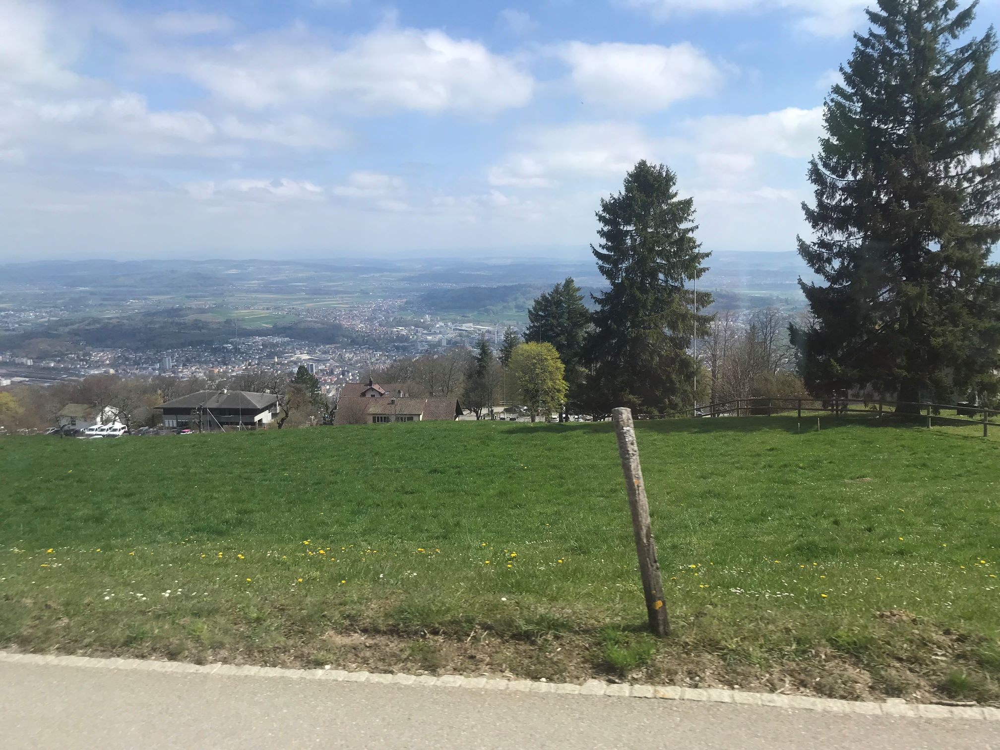
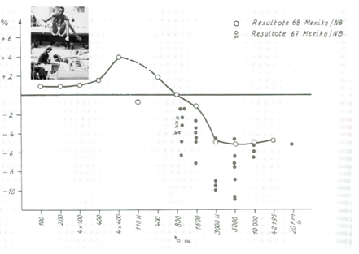
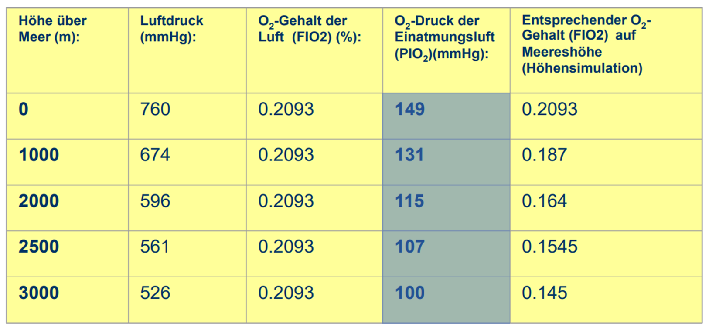
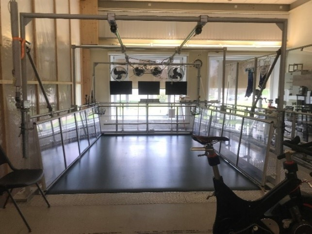
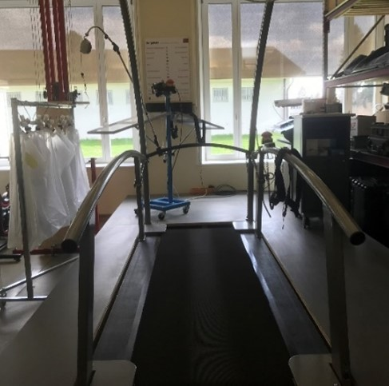
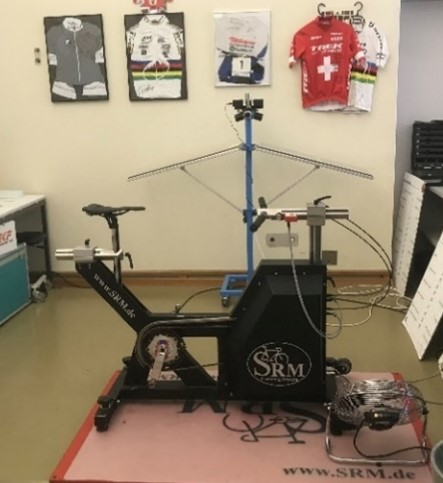

+++
title = "Höhentraining - Der Schlüssel zum sportlichen Erfolg, in den Bergen?"
date = "2023-06-26"
draft = true
pinned = false
+++
# Höhentraining - Der Schlüssel zum sportlichen Erfolg, in den Bergen?



In der Welt des Höhentrainings, dort wo sich die Athleten an ihre Grenzen bringen, um grandiose Leistungen zu erzielen, gibt es einiges zu beachten. Worauf muss man achten und wer kann profitieren? Dieser Frage habe ich mich in dieser Reportage angenommen.


*Autoren: Fabian Schmid & Gian Federer*

## Besuch bei der Eidgenössischen Hochschule für Sport (EHSM)

In einem Artikel über die Fussball-WM in Qatar stolperte ich über den Begriff Höhentraining. Ich habe nicht gewusst, was Höhentraining ist. Deshalb habe ich beschlossen, die Zeitung beiseitezulegen und meine Zeit mit der Recherche über Höhentraining zu verbringen. So hat das alles begonnen, und jetzt sitze ich hier, im Zug nach Biel, um mich mit Jon Wehrlin von der Eidgenössischen Hochschule für Sport zu treffen. Ich freue mich, denn ich werde heute sicher viel über Höhentraining erfahren. Nach einer 21 Minuten langen Zugfahrt komme ich in Biel am Hauptbahnhof an. Schon als ich den Zug mit all meinen Sachen verlasse, kann ich das Ziel meiner Reise, das hoch über Biel liegt, bereits sehen. Ich schaue nach, wann die Magglingen-Bahn fährt, und werde überrascht. Denn ich habe nicht beachtet, dass die Bahn aufgrund von Wartungsarbeiten gar nicht fährt. Ich gehe zur Touristeninformation und frage, ob es einen alternativen Weg gibt. Zu meinem Glück fährt parallel zur Magglingen-Bahn die Leubringen-Bahn. Ich bedanke mich für die Auskunft und mache mich auf den Weg zum Bus, der mich zur Talstation bringt. Die Bahn fährt los, sobald ich eingestiegen bin. Während ich nach oben fahre und die Aussicht geniesse, fühle ich mich fast wie ein Profisportler, der sich auf dem Weg zum Training in der Höhe befindet.  Die Bahn hält, und ich steige aus, glücklicherweise fährt der Bus schon in zwei Minuten. Ich setze mich hin und schaue aus dem Fenster, denn aus dem Bus hat man eine fabelhafte Aussicht. Nach einer kurzen Fahrt erreiche ich mein Ziel. Jon Wehrlin, der bereits an der Haltestelle wartet, begrüsst mich. Anschliessend führt er mich in sein Büro, wo ich meine Fragen stellen kann.



## Der Beginn des Höhentrainings

Jon Wehrlin über die Anfänge des Höhentrainings:
Das Höhentraining hat seinen Ursprung im Jahre 1968, als die Olympischen Spiele in Mexiko City stattfanden. Mexiko City liegt auf 2500 Metern über Meer. Damals wusste man noch nicht, wie sich die Höhe auf die Leistung der Sportler*innen auswirkt. Im Anschluss an die Olympischen Spiele hat man dann die erreichten Leistungen der Sportler in den verschiedenen Disziplinen mit den Bestleistungen der Olympischen Spiele anderer Jahre verglichen. 

In diesem Diagramm siehst du die verschiedenen Disziplinen mit den dazugehörigen Leistungen. 
Man kann erkennen, dass die Leistungen bei den Sprints besser waren als in den anderen Jahren, bei den Ausdauerdisziplinen erzielten die Athleten jedoch schlechtere Leistungen. Bei den 800-Meter-Läufen waren die Leistungen in der Höhe gleich wie bei Wettkämpfen in niedriger Höhe. 
Der Grund für die besseren Leistungen bei den Sprints ist, dass es in der Höhe einen tieferen Luftdruck und somit auch einen tieferen Luftwiderstand gibt. Ist der Luftdruck tiefer, sind die Sauerstoff- und Stickstoffmoleküle auf ein grösseres Volumen verteilt. Somit gibt es weniger Moleküle, welche einen Widerstand verursachen. Dies macht sich vor allem bei Sportarten wie Radfahren, Weitsprung und Sprints bemerkbar. Generell kann man sagen, dass der Effekt bei Sportarten, in denen man sich schnell bewegt, grösser ist. 

In der Höhe muss man jedoch viel mehr atmen, um an die gleiche Menge Sauerstoff zu kommen. Daher die schlechteren Leistungen in Ausdauersportarten. Auf 3000 Meter über Meer muss man sogar ein Drittel mehr Luft einatmen, um an dieselbe Menge Sauerstoff wie auf Meereshöhe zu kommen. Für die Ausdauerleistungsfähigkeit ist der Sauerstoffdruck der Einatmungsluft entscheidend. 

Wie du der Grafik entnehmen kannst, ist die Quecksilbersäule auf Meereshöhe etwa 149mm hoch, auf 3000m sind es nur noch zwei Drittel, also 100mm. Auf 3000m hat man einfach weniger Sauerstoff zur Verfügung. 

Wir haben dazu einmal einen Versuch gemacht. Bei diesem Versuch sind die Athleten mit 50% Intensität auf dem Laufband gelaufen. In der Höhe braucht man bei derselben Belastung, nehmen wir zum Beispiel 10km/h, gleich viel Sauerstoff wie im Flachland, das heisst, dass die Effizienz dieselbe ist. Jedoch hat der Körper weniger Sauerstoff zur Verfügung. Der Körper reagiert auf dieses Defizit, indem das Herz schneller schlägt, damit die gleiche Menge Sauerstoff im Blut transportiert wird. Für die gleiche Belastung hat man auf 300m eine Herzfrequenz von 133 Schlägen pro Minute, auf 2800m schlägt das Herz dann schon 150-mal in der Minute. Das heisst, dass die Ausdauerleistungsfähigkeit in der Höhe schlechter ist, da sie stark mit der Sauerstoffaufnahme zusammenhängt. 





## Wer ist Jon Wehrlin?

Dr. Jon Wehrlin ist Leiter der Abteilung Ausdauerphysiologie an der Eidgenössischen Hochschule für Sport in Magglingen, Schweiz (EHSM). Herr Wehrlin hat nach dem Lehrerseminar an der Uni Bern Sportlehrer studiert und schliesslich an der Universität in Oslo den Doktortitel in Sportwissenschaften erworben. Herr Wehrlin ist schon seit vielen Jahren in der Höhentrainingsforschung tätig. Während seiner Karriere hat er schon zahlreiche Berichte über Höhentraining veröffentlicht. Herr Wehrlin’s Abteilung ist für die wissenschaftliche Betreuung verschiedener Schweizer Nationalsportler zuständig. *Dazu zählen Sportler*innen der Sportarten Langlauf, Biathlon, Mountainbike, Bahnradfahren, Triathlon und Leichtathletik. 



## Wie läuft ein Höhentraining ab?

Sobald ich und Jon Wehrlin in seinem Büro angekommen sind und ich mich gesetzt habe, kann ich ihm meine erste Frage stellen. Ich will wissen, wie ich meine Leistung mithilfe des Höhentrainings verbessern kann. 
Jon Wehrlin antwortet mir, dass Amateursportler*innen an anderen Orten, wie der Fitness, noch viel mehr Potenzial haben und ein Höhentraining deshalb für mich als Amateursportler keinen Sinn macht. Ein Höhentraining ist für Profisportler*innen, bei denen schon alle anderen Möglichkeiten ausgereizt sind. Wenn man als Amateursportler jedoch ein Höhentraining absolviert, dann als Vorbereitung für einen Wettkampf in der Höhe, so Jon Wehrlin. Weiter ergänzt er: "Bei Wettkämpfen im Flachland ist es sehr schwierig zu sagen, ob ein Höhentraining unbedingt nötig ist.” Dies gelte   auch für Profisportler. Das zu hören enttäuscht mich natürlich ein wenig. Meine nächste Frage ist: Was so ein Höhentraining überhaupt sei und wie es funktioniere. Ich erfahre, dass ein Höhentraining, wie der Name schon sagt, in der Höhe stattfindet. Um den positiven Effekt eines Höhentrainings zu erfahren, muss man sich über einen grösseren Zeitraum in der Höhe aufhalten. Die Dauer beträgt etwa 3 Wochen, erklärt er mir. Weiter ergänzt er, dass das noch nicht alles ist, denn man muss vieles beachten. "Wenn man in die Höhe geht, ist wichtig, dass man sich an gewisse Regeln hält.” sagt Jon Wehrlin und präzisiert: “Wenn man gerade in die Höhe kommt, muss man aufpassen, dass man sich nicht überanstrengt und in ein Übertraining kommt. Man muss sich zuerst akklimatisieren.”  Diese Anpassungsphase dauert etwa zehn Tage und wird «period of poor performance» genannt. Der Körper benötigt diese Zeit, um wieder in Topform zu kommen.

## Das Höhentraining aus medizinischer Sicht

Das alles ist sehr interessant, denke ich mir, denn obwohl ich zu Hause schon zum Thema recherchiert habe, habe ich einiges erfahren, was ich noch nicht gewusst habe. Was ich aber schon ungefähr gewusst habe ist, dass die Leistung von Sportler*innen durch ein Höhentraining erhöht werden kann. Um noch mehr übers Detail zu erfahren, frage ich Herrn Wehrlin nach der medizinischen Erklärung. Er erklärt mir, dass das Ganze mit der Sauerstoffsättigung zu tun hat. Er fragt mich, ob ich eine Erklärung der Sauerstoffsättigung benötige. Ich nehme dieses Angebot dankend an. Im Blut befindet sich Hämoglobin, beginnt er, dieses Hämoglobin transportiert den Sauerstoff zu den Muskeln. Jedes dieser Hämoglobinteilchen kann bis zu vier Sauerstoffmoleküle gleichzeitig transportieren. Manchmal transportieren diese Hämoglobinteilchen aber auch nur drei oder weniger Sauerstoffatome, fährt er fort. Die Sauerstoffsättigung wird in Prozent angegeben und beschreibt die Anzahl an transportierten Sauerstoffteilchen. Wenn jedes Hämoglobinteilchen nur drei Sauerstoffteilchen transportiert, dann hat man eine Sauerstoffsättigung von 75%. Jetzt kann ich mich wieder an die Definition der Sauerstoffsättigung erinnern. Um den Prozess, der während eines Höhentrainings im menschlichen Körper abläuft, zu erklären, muss man die Bedeutung dieses Begriffes kennen. In der Höhe gibt es weniger Sauerstoff und deshalb kann man logischerweise auch weniger Sauerstoff aufnehmen, somit fehlt dem Körper Sauerstoff. Der Körper muss sich also auf diese neue Situation einstellen und produziert mehr Hämoglobin, damit mehr Sauerstoff transportiert werden kann. Wenn man jetzt aus dem Höhentraining zurück ins Flachland geht, hat man mehr Hämoglobin als die anderen Teilnehmer, die kein Höhentraining absolviert haben. Durch diesen Vorteil gelangt mehr Sauerstoff zu den Muskeln. Durch die erhöhte Sauerstoffmenge wird die Leistung der Muskeln erhöht, wodurch sich die Gesamtleistung verbessert. Jon Wehrlin bestätigt meine Vermutung und erklärt mir zudem, dass so ähnlich auch gedopt werde, aber der Unterschied ist, dass beim Doping das Hämoglobin nicht natürlich vom Körper produziert werde. Es wird mittels Bluttransfusion dem Körper zugeführt, das zugeführte Blut hat eine höhere Konzentration der roten Blutkörperchen. 

## Die verschiedenen Umsetzungen und ihre Vor- und Nachteile

Endlich weiss ich, welche Wirkung ein Höhentraining auslöst. Während meiner Recherche bin ich auf verschiedene Umsetzungen des Höhentrainings gestossen. Laut den Berichten, die ich gelesen habe, gibt es einen Nachteil, wenn man in der Höhe trainiert. Aufgrund des Sauerstoffmangels kann man in der Höhe weniger intensiv trainieren. Ich frage Jon Wehrlin, ob das stimmt und wie man dieses Problem umgehen kann. Er bestätigt mir, dass das tatsächlich der Fall ist. Ganz umgehen kann man dieses Problem nicht. Man kann es jedoch minimieren, indem man im Flachland trainiert und in der Höhe übernachtet. Somit kann man die Intensität des Trainings beibehalten und trotzdem noch einen Teil des Vorteiles eines Höhentrainings mitnehmen. Wenn man aber in der Höhe leben will und trotzdem im Flachland trainieren geht, muss man für jedes Training ins Tal und danach wieder zurück in die Höhe, führt er fort. Um die optimale Balance zu finden, schlägt er vor, nur jedes zweite Training im Flachland zu absolvieren, damit die Zeit für die Fahrt ins Tal verringert werden kann. Es ist aber immer ein Abwägen, was einem wichtiger ist und jeder Athlet und jede Athletin muss für sich selbst entscheiden, was das Beste für ihn oder sie ist. 

## Wettkampf in der Höhe, wie sieht’s mit einem Höhentraining aus?

Wie wir bereits wissen, kann man in der Höhe nicht die absolute Bestleistung abrufen. Mich interessiert nun, ob man auch dieses Problem bekämpfen kann.
Jon Wehrlin erklärt mir, dass es für dieses Problem zwei mögliche Lösungen gibt. Erstens kann man direkt aus dem Flachland in die Höhe an den Wettkampf gehen. Dabei darf dem Körper keine Zeit gegeben werden, um sich an die Höhe anzupassen, denn während dieser Anpassungsphase kann die maximale Leistung des Körpers nicht abgerufen werden. Dies führt aber wiederum andere Probleme mit sich, denn man hat keine Zeit, sich am Wettkampfort vorzubereiten. Und wenn der Wettkampf sich über mehrere Tage erstreckt, fällt diese Möglichkeit sowieso schon weg.
Die zweite Möglichkeit ist, vorher ein Höhentraining zu absolvieren. Man geht vor dem Wettkampf in die Höhe, nimmt sich Zeit für sein Höhentraining und geht dann, sobald sich der Körper an die Höhe gewöhnt hat, an den Wettkampf. Jon Wehrlin erklärt mir diese beiden Möglichkeiten an einem Beispiel. Es geht um die Mountainbike WM in Andorra. Dort hat das Schweizer Team vorher ein Höhentraining auf dem Bernina Pass absolviert, und die Franzosen sind direkt an den Wettkampf gegangen. Die Schweizer gewannen diesen Wettkampf. Jedoch kann man daraus nicht viel ableiten. Denn vielleicht sind die Schweizer einfach besser im Mountainbikefahren.

## Die Trainingseinrichtung in Magglingen

Jon Wehrlin hat alle meine Fragen geklärt, aber ich habe noch nichts von der Einrichtung, die von der EHSM verwendet wird, gesehen. 
Es hat ein grosses Laufband, worauf sogar Radfahrer und Langläufer trainieren können. Es gibt jedoch nicht nur dieses Laufband, sondern auch noch viele andere Geräte (siehe unten). Obwohl ich das Training der Mountainbiker knapp verpasst habe, ist es trotzdem ein zwar recht kurzer, aber sehr interessanter Einblick gewesen. Wir verabschieden uns, und ich werfe noch einen letzten Blick auf die Sporthalle, bevor ich in den Bus einsteige und mich wieder auf meinen langen Heimweg mache.

